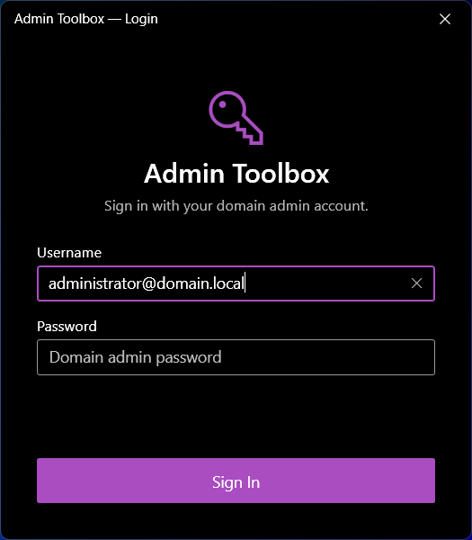
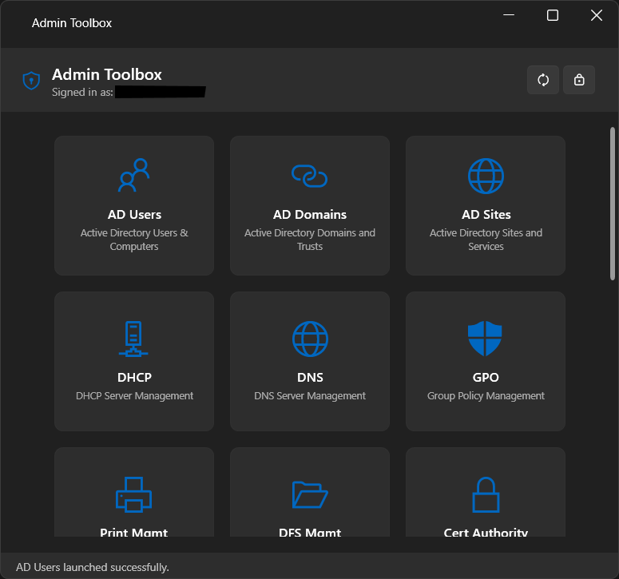

# Admin Toolbox


A unified Windows desktop dashboard for launching RSAT and built-in administration tools under domain admin credentials — sign in once, launch everything.

Built with WPF (.NET 9) and [WPF UI](https://github.com/lepoco/wpfui) for a native Windows 11 Fluent Design look and feel.

---

## Screenshots

| Login | Dashboard |
|:---:|:---:|
|  |  |

---

## Features

- **Credential-gated launch** — Sign in once with your domain admin account (UPN or SAM format). All MMC snap-ins are launched using `CreateProcessWithLogonW` with `LOGON_NETCREDENTIALS_ONLY` (equivalent to `runas /netonly`).
- **Dynamic tool detection** — Automatically scans the system for installed `.msc` snap-ins and only shows available tools. Hit the refresh button to re-scan after installing new features.
- **21 admin tools** — Covers both RSAT role administration tools (AD, DHCP, DNS, GPO, Print, Certificates, DFS) and built-in Windows tools (Services, Event Viewer, Task Scheduler, Computer Management, and more).
- **System tray integration** — Minimize to the notification area. Double-click to restore. Tray context menu for Show, Lock, and Exit.
- **Lock / credential wipe** — Lock button clears credentials from memory (SecureString, zeroed on disposal) and returns to the login screen.
- **Smooth scrolling** — The tool grid uses frame-rate-synced lerp scrolling for fluid navigation.
- **Single-instance enforcement** — Launching the shortcut while the app is already running (even when minimized to tray) brings the existing window to the foreground.
- **Remember last username** — The login screen pre-fills the username from the previous session.
- **Double-click protection** — Tool tiles are temporarily disabled after click to prevent duplicate launches.

---

## Included Tools

### RSAT Role Administration Tools

These require the corresponding RSAT Windows capability to be installed:

| Tool | Snap-in | RSAT Capability |
|---|---|---|
| AD Users & Computers | `dsa.msc` | `Rsat.ActiveDirectory.DS-LDS.Tools` |
| AD Domains and Trusts | `domain.msc` | `Rsat.ActiveDirectory.DS-LDS.Tools` |
| AD Sites and Services | `dssite.msc` | `Rsat.ActiveDirectory.DS-LDS.Tools` |
| DHCP Server Management | `dhcpmgmt.msc` | `Rsat.DHCP.Tools` |
| DNS Server Management | `dnsmgmt.msc` | `Rsat.Dns.Tools` |
| Group Policy Management | `gpmc.msc` | `Rsat.GroupPolicy.Management.Tools` |
| Print Management | `printmanagement.msc` | `Rsat.PrintManagement.Tools` |
| DFS Management | `dfsmgmt.msc` | `Rsat.FileServices.Tools` |
| Certification Authority | `certsrv.msc` | `Rsat.CertificateServices.Tools` |
| Certificate Templates | `certtmpl.msc` | `Rsat.CertificateServices.Tools` |

### Built-in Windows Admin Tools

Always available on Windows 10/11 — no additional installation required:

| Tool | Snap-in |
|---|---|
| Computer Management | `compmgmt.msc` |
| Event Viewer | `eventvwr.msc` |
| Services | `services.msc` |
| Task Scheduler | `taskschd.msc` |
| Disk Management | `diskmgmt.msc` |
| Device Manager | `devmgmt.msc` |
| Shared Folders | `fsmgmt.msc` |
| Local Users and Groups | `lusrmgr.msc` |
| Windows Firewall (Advanced) | `wf.msc` |
| Local Group Policy Editor | `gpedit.msc` |
| Local Security Policy | `secpol.msc` |

---

## Prerequisites

- **Windows 10 version 1809+** or **Windows 11** (x64)
- .NET 9 runtime is bundled (self-contained publish)
- Administrator rights (required for `CreateProcessWithLogonW` and RSAT installation)

---

## Installation

### Download

Download the latest `AdminToolbox-Setup.exe` from the [Releases](https://github.com/IT-BAER/admin-toolbox/releases) page.

> **Windows SmartScreen:** Since the installer is not code-signed, Windows SmartScreen may show a warning on first run. Click **"More info"** → **"Run anyway"** to proceed. You can verify the download integrity using the `SHA256SUMS.txt` file included in each release.

### Using the Installer

Run `AdminToolbox-Setup.exe`. The installer will:

1. Install the application to `%ProgramFiles%\IT-BAER\Admin Toolbox`
2. Create Start Menu and Desktop shortcuts
3. Optionally install selected RSAT features (checkboxes on the Tasks page)

### Silent Installation

```powershell
# Silent install with progress bar
AdminToolbox-Setup.exe /SILENT

# Fully silent (no UI)
AdminToolbox-Setup.exe /VERYSILENT /SUPPRESSMSGBOXES

# Silent with specific RSAT features only
AdminToolbox-Setup.exe /VERYSILENT /TASKS="rsat\ad,rsat\dns,rsat\gpo"

# Silent without any RSAT features
AdminToolbox-Setup.exe /VERYSILENT /TASKS=""

# With install log
AdminToolbox-Setup.exe /VERYSILENT /SUPPRESSMSGBOXES /LOG="C:\temp\install.log"
```

Available `/TASKS` values: `rsat\ad`, `rsat\dhcp`, `rsat\dns`, `rsat\gpo`, `rsat\print`, `rsat\cert`, `rsat\fileservices`

---

## Building from Source

### Requirements

- [.NET 9 SDK](https://dotnet.microsoft.com/download/dotnet/9.0)
- [Inno Setup 6](https://jrsoftware.org/isinfo.php) (auto-installed via winget if missing)

### One-Click Build

```powershell
.\build-installer.ps1
```

This runs `dotnet publish` (Release, win-x64, self-contained, single-file) and compiles the Inno Setup installer. Output: `bin\Installer\AdminToolbox-Setup.exe`.

### Manual Build

```powershell
# 1. Publish
dotnet publish AdminToolbox.csproj -c Release -r win-x64 --self-contained true -p:PublishSingleFile=true -o bin\Publish

# 2. Compile installer
& "$env:LOCALAPPDATA\Programs\Inno Setup 6\ISCC.exe" installer\AdminToolbox.iss
```

---

## Project Structure

```
Admin-Toolbox/
├── AdminToolbox.csproj        # .NET 9 WPF project
├── app.manifest               # UAC elevation (requireAdministrator)
├── App.xaml / App.xaml.cs     # Application startup, global error handler
├── GlobalUsings.cs            # WPF/WinForms type disambiguation
├── Assets/
│   └── AdminToolbox.ico       # Multi-resolution app icon
├── Models/
│   ├── AdminTool.cs           # Tool definitions + dynamic detection
│   └── CredentialStore.cs     # SecureString credential vault
├── Services/
│   └── ProcessLauncher.cs     # CreateProcessWithLogonW P/Invoke
├── Views/
│   ├── LoginWindow.xaml/.cs   # Domain admin login dialog
│   └── MainWindow.xaml/.cs    # Dashboard with tool tiles
├── installer/
│   ├── AdminToolbox.iss       # Inno Setup 6 script
│   └── install-rsat.ps1       # RSAT capability installer
├── build-installer.ps1        # One-click build script
└── generate-icon.ps1          # Icon generation (System.Drawing)
```

---

## Security

- Credentials are stored **in memory only** using `SecureString` — never written to disk, registry, or any persistent storage
- The `SecureString` is zeroed and disposed on app exit, lock, or credential clear
- The unmanaged BSTR used for `CreateProcessWithLogonW` is zeroed via `Marshal.ZeroFreeGlobalAllocUnicode` immediately after the API call
- The app manifest requires administrator elevation; UAC fires once at launch

---

## Technology Stack

| Category | Technology | Version |
|---|---|---|
| Runtime | .NET | 9.0 |
| UI Framework | WPF + WPF UI (Lepo) | 4.2.0 |
| Credential API | CreateProcessWithLogonW | P/Invoke |
| Installer | Inno Setup | 6 |
| Publish | Self-contained, single-file | x64 |

---

## 📄 License

MIT

<br>

## 💜 Support

If you find this tool useful, consider supporting future development:

<div align="center">
<a href="https://www.buymeacoffee.com/itbaer" target="_blank"></a>
<br>
<a href="https://www.paypal.com/donate/?hosted_button_id=5XXRC7THMTRRS" target="_blank">Donate via PayPal</a>
</div>
